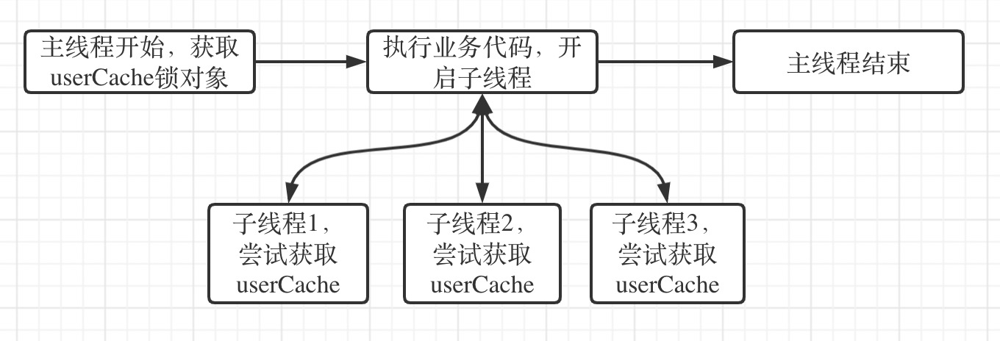

## parallelStream和synchronized使用不当造成死锁

 - 问题场景
 - 问题发现
 - 问题解决
 - 问题回顾

#### 问题场景

在系统中使用了缓存，每次缓存加载的时候使用单例双重检查方式防止缓存重复加载。业务代码如下：

``` java
public class UserCache{
  //获取用户信息服务
  private UserService userService;
  
  private void loadData(){
    if (!redisTemplate.hasKey(USER_LIST_REDIS_KEY)) {
      //double check
            synchronized (UserCache.class) {
                if (!redisTemplate.hasKey(USER_LIST_REDIS_KEY)) {
                    redisTemplate.opsForValue().set(USER_LIST_REDIS_KEY, userService.list());
                }
            }
        }
  }
}
```

在userService中也会去检查当前是否有缓存(为单用户缓存)，如果有则直接返回，业务代码如下：

```java
List<UserRolePrivilegeOutputDTO> result = Lists.newArrayList();
        List<UserDO> userList = queryAllUser();
        userList.parallelStream().forEach(user -> {
          	//userCache中获取会加载当前user附属数据，也会用到UserCache.class的锁
            UserOutputDTO currentUser = userCache.getEmployee(user.getUserId());
            //.....省略部分业务代码
            result.add(userRolePrivilegeOutputDTO);
        });
        return result;
```

#### 问题发现

当项目启动后，每个请求到user接口的进来都在pending，项目假死。查看jvm内存均无异常。

查看查看当前jvm中的线程状态，发现大多数请求线程都是blocked状态。最终定位一个线程获取到了UserCache.class的锁，一直没有释放。

synchronized本身是自动释放锁的，为何导致了synchronized没有释放锁？

可能是产生了死锁？

根据代码分析，在userCache获取锁之后，开启了多线程去加载数据，而每个线程都有可能再次去获取锁，这就导致了主线程已经获取到锁等待子线程任务结束，而子线程又需要获取到锁，产生了资源竞争，从而导致死锁。大致流程图如下：



synchronized是可重入锁，但是主线程开启了子线程，不是同一个线程中，子线程一直会等待主线程释放userCache锁对象，而主线程又在等待子线程结束，就导致整个线程被卡死。

#### 解决问题

直接把开启线程的地方关闭，通过for循环单线程去执行，利用synchronized可重入性，解决问题。

